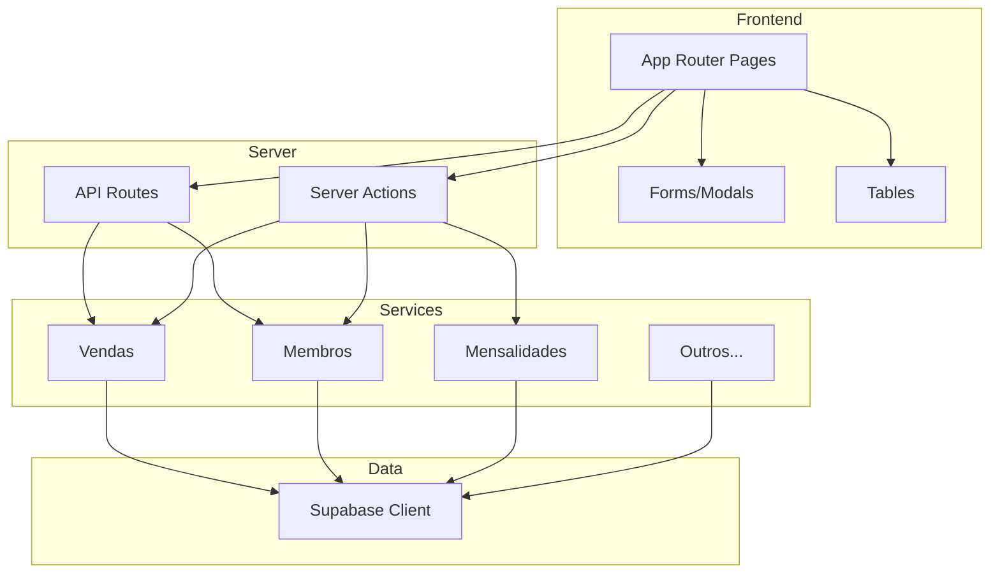

# SGB - Guia para Agentes

Documentação para agentes que desenvolvem novas features no **Sistema de Gestão do Borba** (Clube de Desbravadores Borba Gato, IASD Santo Amaro).

## Visão Geral

O SGB é um sistema de gestão para clube de desbravadores, cobrindo:

- **Unidades** – Grupos com conselheiros
- **Membros** – Desbravadores e diretoria
- **Presenças** – Chamada nos encontros
- **Especialidades** – Conquistas
- **Mensalidades** – Controle financeiro
- **Vendas, Doações, Gastos** – Receitas e despesas
- **Acampamentos** – Inscrições e pagamentos
- **Pães** – Pedidos recorrentes e créditos

## Stack Tecnológica

| Tecnologia | Uso |
|------------|-----|
| Next.js 16 | App Router, SSR, API Routes |
| React 19 | UI |
| Supabase | PostgreSQL, Auth |
| Tailwind CSS 4 | Estilização |
| TypeScript | Tipagem |
| React Hook Form + Zod | Formulários e validação |
| date-fns | Datas |
| lucide-react | Ícones |

## Arquitetura



## Estrutura de Diretórios

```
src/
├── app/                    # App Router
│   ├── (auth)/login/       # Login
│   ├── (dashboard)/        # Dashboards por papel
│   │   ├── admin/          # Admin (acesso total)
│   │   ├── secretaria/     # Secretaria
│   │   ├── tesoureiro/     # Tesoureiro
│   │   └── conselheiro/    # Conselheiro
│   └── api/                # API Routes
├── components/
│   ├── layout/             # Sidebar, Header, DashboardShell
│   ├── ui/                 # Button, Input, Modal, Card, Table, etc.
│   ├── forms/              # Modais e formulários
│   ├── tables/             # Tabelas por entidade
│   └── financial/          # MensalidadesControl
├── hooks/                  # use-auth
├── lib/
│   ├── supabase/           # client.ts, server.ts
│   ├── utils/              # cn, format, date, case-converter
│   └── constants.ts
├── services/               # Lógica de negócio (~25 services)
├── types/                  # Tipos TypeScript
└── proxy.ts               # Lógica de auth (não é middleware ativo)
```

## Papéis e Rotas

| Papel | Base URL | Acesso |
|-------|----------|--------|
| **admin** | `/admin` | Total: membros, unidades, encontros, financeiro, receitas, relatórios |
| **secretaria** | `/secretaria` | Membros, unidades, conselheiros, usuários |
| **tesoureiro** | `/tesoureiro` | Presenças, mensalidades, gastos, eventos, acampamentos, vendas, doações, pães |
| **conselheiro** | `/conselheiro` | Minha unidade, encontros, chamada, mensalidades |

## Convenções Críticas

### Nomenclatura

| Contexto | Convenção | Exemplo |
|----------|-----------|---------|
| Banco de dados | snake_case | `data_nascimento`, `unidade_id` |
| TypeScript | camelCase | `dataNascimento`, `unidadeId` |
| Arquivos | kebab-case | `use-auth.ts`, `case-converter.ts` |
| Componentes | PascalCase | `VendaModal`, `MembrosTable` |

### Conversão snake ↔ camel

- **Banco** usa `snake_case`; **código** usa `camelCase`.
- Sempre converter com `snakeToCamel` e `camelToSnake` de `@/lib/utils/case-converter`.
- Ao retornar dados do banco: `snakeToCamel<T>(row)`.
- Ao inserir/atualizar: `camelToSnake(formData)`.

### Services

- Importar `createClient` de `@/lib/supabase/server`.
- Usar `const db = supabase as any` para queries dinâmicas (`.from()`, `.select()`, etc.).
- Um service por domínio em `src/services/`.
- Exemplo: `src/services/membros.ts`.

### Path alias

- `@/*` → `./src/*` (tsconfig.json).

## Fluxo para Nova Feature

1. **Service** – Criar/atualizar em `src/services/` com lógica de negócio.
2. **API ou Actions** – API Route em `app/api/` ou Server Action em `**/actions.ts`.
3. **Página** – Em `app/(dashboard)/[papel]/[feature]/page.tsx`.
4. **Form/Table** – Componentes em `components/forms/` e `components/tables/`.
5. **Sidebar** – Adicionar item em `src/components/layout/sidebar.tsx` se for nova rota.

## Constantes Importantes

Arquivo: `src/lib/constants.ts`

- `ROLES`, `ROLE_LABELS` – Papéis de usuário
- `PRESENCE_STATUS`, `PRESENCE_LABELS` – Status de presença
- `MEETING_STATUS`, `MEETING_LABELS` – Status de encontro
- `MENSALIDADE_DESBRAVADOR`, `MENSALIDADE_DIRETORIA` – Valores
- `MESES_LABELS`, `MESES_ABREVIADOS` – Meses
- `STATUS_MENSALIDADE_LABELS` – Pendente/Pago

## Autenticação

- **Login**: `src/app/(auth)/login/page.tsx` → `useAuth` → Supabase `signInWithPassword`.
- **Proteção**: `src/app/(dashboard)/layout.tsx` valida usuário e `usuario.ativo`.
- **proxy.ts**: Contém lógica de auth, mas **não está ligado ao middleware do Next.js**. A proteção real está no layout do dashboard.

## Regras para Agentes (.cursor/rules/)

Regras persistentes em `.cursor/rules/` que orientam o contexto dos agentes:

| Regra | Quando aplica | Conteúdo |
|-------|----------------|----------|
| `sgb-overview.mdc` | Sempre | Visão geral, stack, papéis, estrutura, fluxo para nova feature |
| `services-pattern.mdc` | Em `src/services/**` | Supabase, case-converter, padrão de queries |
| `forms-tables-pattern.mdc` | Em forms e tables | React Hook Form, Zod, componentes UI |
| `pages-actions-api.mdc` | Em `src/app/**` | Pages, Server Actions, API Routes |
| `naming-case-converter.mdc` | Em `.ts`/`.tsx` | Nomenclatura, snake_case ↔ camelCase |
| `types-constants.mdc` | Em types e constants | Tipos e constantes do projeto |

## Arquivos de Referência

| Categoria | Arquivos |
|-----------|----------|
| Auth | `src/hooks/use-auth.ts`, `src/app/(auth)/login/page.tsx` |
| Supabase | `src/lib/supabase/server.ts`, `src/lib/supabase/client.ts` |
| Tipos | `src/types/database.ts`, `src/types/auth.ts`, `src/types/membro.ts` |
| Utils | `src/lib/utils/case-converter.ts`, `src/lib/utils/format.ts` |
| Menu | `src/components/layout/sidebar.tsx` |
